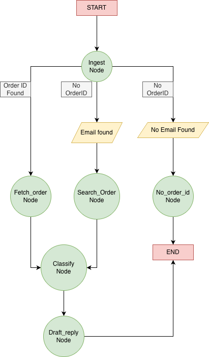

# Viridien LangGraph Triage System

A LangGraph-based ticket triage system that automatically classifies customer support tickets, fetches order information, and generates reply recommendations.

## Prerequisites

- Python 3.12+
- Backend service running (see Backend Service section)

## Installation

1. Clone the repository and navigate to the project directory:
```bash
cd viridien-langGraph
```

2. Create a virtual environment (optional but recommended):
```bash
python3.12 -m venv myenv
source myenv/bin/activate  # On Windows: myenv\Scripts\activate
```

3. Install dependencies:
```bash
pip install -r requirements.txt
```

4. Configure environment variables:
Create a `.env` file in the `graph/` directory with:
```
BACKEND_URL=http://localhost:8000
```

## Running the Services

### Backend Service

The backend service that is the one shared, p1-seafoam-cicada. And this service must be running before starting the LangGraph service.


Below is the **run.sh** script for p1-seafoam-cicada:
```aiignore
#!/bin/bash
# Simple bash script to run the FastAPI server
# Usage: ./run.sh

cd "$(dirname "$0")"

# Activate virtual environment if it exists
if [ -d ".venv" ]; then
    source .venv/bin/activate
fi

# Run the server
uvicorn app.main:app --host 0.0.0.0 --port 8000

```

**Using Bash Script**
```bash
cd <backend-directory>
./run.sh
```
The backend service will start on `http://localhost:8000`

### LangGraph Service

**Once the backend is running, start the LangGraph service using Bash Script**
```bash
./run.sh
```

The LangGraph service will start on `http://localhost:8001` (default) or your specified port.

## Running Tests

Run all tests:
```bash
python3.12 -m unittest discover -s graph/tests -p "test_*.py" -v
```

Run specific test file:
```bash
python3.12 -m unittest graph.tests.test_ingest -v
```

Run with pytest (if installed):
```bash
python3.12 -m pytest graph/tests/ -v
```

## Architecture

This system implements a **three-entity multi-agent architecture**:

### 1. Customer
- **Role**: Initiates the support ticket
- **Input**: Provides `ticket_text` (e.g., "My speaker is not working ORD1002")
- **Implementation**: Not represented as a node; exists as the initial input to the workflow

### 2. Assistant (Autonomous Agent)
- **Role**: Processes tickets and generates recommendations
- **Responsibilities**:
  - Extracts order_id and customer_email from ticket text
  - Fetches order details from backend systems
  - Classifies issue type (defective, shipping, refund, etc.)
  - Drafts reply recommendations
- **Implementation**: The entire LangGraph workflow (all nodes: ingest, fetch_order, classify, draft_reply, etc.)

### 3. Admin (Approver)
- **Role**: Validates and approves assistant recommendations
- **Implementation in Phase 1**: Implicit - backend API endpoints act as decision validators
- **Future Phases**: Will include explicit human-in-the-loop approval gates

This architecture separates concerns: customers describe problems, the assistant autonomously triages and proposes solutions, and admins ensure quality before final action.

## Project Structure

```
viridien-langGraph/
├── app/
│   ├── main.py              # FastAPI application
│   └── TriageInput.py       # Input model
├── graph/
│   ├── TriageState.py       # State definition
│   ├── builder.py           # Graph builder
│   ├── nodes/               # Graph nodes (Assistant agent)
│   │   ├── ingest.py        # Ingests ticket and extracts data
│   │   ├── classify.py      # Classifies issue type
│   │   ├── fetch_order.py   # Fetches order details
│   │   ├── search_orders.py # Searches orders by email
│   │   ├── draft_reply.py   # Generates reply recommendation
│   │   └── no_order_id.py   # Handles missing order ID
│   └── tests/               # Unit tests
├── requirements.txt         # Python dependencies
├── run.sh                   # Bash run script
└── run.py                   # Python run script
```

## Workflow

The triage system follows this workflow:


1. **Ingest**: Extracts order_id from ticket text (pattern: `ORD\d{4}`)
   - If order_id is found, it's added to state
   - If order_id is NOT found, attempts to extract customer_email as fallback

2. **Routing Decision** (after ingest):
   - If order_id found → Fetch Order Node
   - If only email found → Search Orders Node
   - If neither found → No Order ID Node End with error message

3. **Search Orders** (only if email found but no order_id):
   - Searches for orders by customer_email
   - If single order found → Sets order_id → routes to Fetch Order Node
   - If multiple/no orders found → End with error message

4. **Fetch Order**: Retrieves order details using order_id

5. **Search Orders**: Searches for orders by customer_email if order_id is missing

6. **Classify**: Determines issue type (defective, shipping, refund, etc.)

7. **Draft Reply**: Generates recommended response based on issue type and order data

## API Endpoints

### LangGraph Service

**POST /triage/invoke**
```json
{
  "ticket_text": "My speaker is not working ORD1002",
  "order_id": null
}
```

**GET /triage**
```
Health check endpoint
```

## Example Usage

```bash
curl -X POST "http://localhost:8001/triage/invoke" \
  -H "Content-Type: application/json" \
  -d '{
    "ticket_text": "My speaker is not working ORD1002",
    "order_id": null
  }'
```


